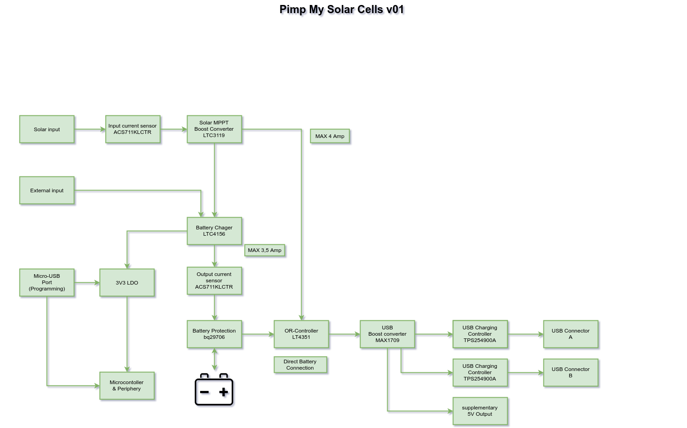

### Komponenten:
* [LTC3119 - 18V, 5A Synchronous Buck-Boost DC/DC Converter](http://www.linear.com/product/LTC3119)
* [LTC4156 - Dual-Input Power Manager/ 3.5A LiFePO4 Battery Charger with I2C Control and USB OTG](http://www.linear.com/product/LTC4156)
* [bq297xx- Voltage and Current Protection](http://www.ti.com/lit/ds/symlink/bq2973.pdf)
* [ECH8693R](http://www.onsemi.com/pub/Collateral/ECH8693R-D.PDF)
* [MAX1709 - 4A, Low-Noise, High-Frequency, Step-Up DC-DC Converter](https://datasheets.maximintegrated.com/en/ds/MAX1709.pdf)
* [10Ah LiFePO4 3,7V Akku](http://shop.lipopower.de/LiNANOZ-10000-mAh-32V-LiFePo-Einzel-Zelle-SL-FHC-2C-140mm)
* [EA EPA20-A](https://shop.lcd-module.de/2-e-paper-4-graustufen.html)
* [STM32L151CBUxA](http://www.st.com/en/microcontrollers/stm32l151cb.html)
* [STM6600 - Smart push-button on/off controller](http://www.st.com/content/ccc/resource/technical/document/datasheet/1f/9e/3b/43/ec/04/44/71/CD00226957.pdf/files/CD00226957.pdf/jcr:content/translations/en.CD00226957.pdf)
* [LT4351 - MOSFET Diode-OR Controller](http://cds.linear.com/docs/en/datasheet/4351fd.pdf)
* [CSD86311W1723 - Dual 30-V N-Channel NexFET Power MOSFETs](http://www.ti.com/product/csd86311w1723)
* ([Si4862DY N-Channel 16-V (D-S) MOSFET](https://www.vishay.com/docs/71439/71439.pdf))
* [TPS254900A - Automotive USB Host Charger With Short-to-VBATT Protection](http://www.ti.com/lit/ds/symlink/tps254900a-q1.pdf)
* [MSS1260T-332 - 3µ3H](https://www.coilcraft.com/mss1260t.cfm)
* [XEL6030-102 - 1µH](https://www.coilcraft.com/xel6030.cfm)
* [FFC / FPC Board Connector, 0.5 mm, 24 Contacts, Receptacle, 52435 Series, Surface Mount, Top](http://uk.farnell.com/molex/52435-2471/connector-fpc-rcpt-24pos-1row/dp/2396220)

### Übersicht:

### Microcontroller:
* Vin, Vext, Vbat
* Iin, Ibat
* LTC3119: PWM/SYNC, MPPC(PWM an MOSFET an Kondensator), PGOOD
* LTC4156: I2C, IRQ
* by297xx: BAT_DISCONECT
* MAX1709: ON_OFF, SYNC (PWM)
* 2xTPS254900A: FAULT, IMON, EN

### Notizen:
* http://elastic-notes.blogspot.de/p/stm32-i2c-oled-ssd.html
* Outline: L: 42mm x B: 38mm
